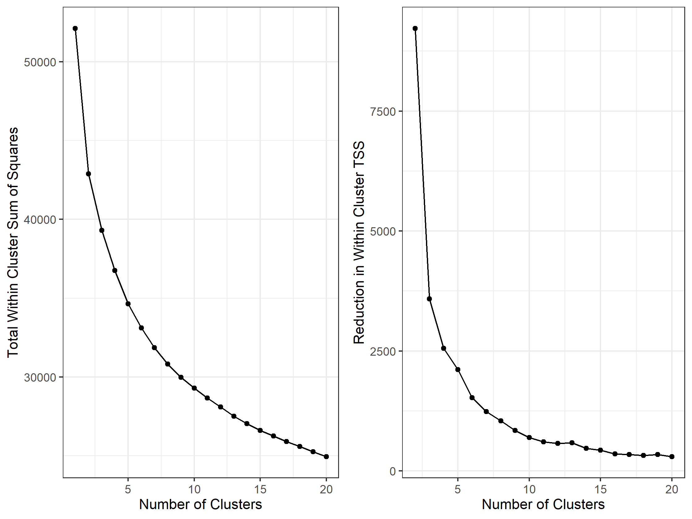

# Wine Marketing Segmentation with Dashboard

A basic clustering of wines based on their physical and chemical properties, created as part of my MSc. Includes an interactive shiny dashboard with plotly graphs, [hosted on my shinyapps.io page.](https://apollock.shinyapps.io/Wine_Marketing_Segmentation) 

The segmentation was created using K-means clustering with k=4 based on the below elbow plot - from 4 clusters onwards the reduction in within-cluster TSS caused by each additional cluster slows significantly.


The first 3 Principal Components explain approximately 52% of the total variance (after centering and scaling), so they've been included in the dashboard as a convenient way to visually seperate the 4 clusters.

``` r
summary(prcomp(wine_data[,1:11], scale = TRUE, center = TRUE))

#> Importance of components:
#>                           PC1    PC2    PC3    PC4     PC5     PC6     PC7     PC8     PC9    PC10    PC11
#> Standard deviation     1.6554 1.2646 1.1758 1.0762 0.97728 0.86689 0.81041 0.78682 0.72106 0.57740 0.53278
#> Proportion of Variance 0.2491 0.1454 0.1257 0.1053 0.08683 0.06832 0.05971 0.05628 0.04727 0.03031 0.02581
#> Cumulative Proportion  0.2491 0.3945 0.5202 0.6255 0.71232 0.78063 0.84034 0.89662 0.94389 0.97419 1.00000

```
